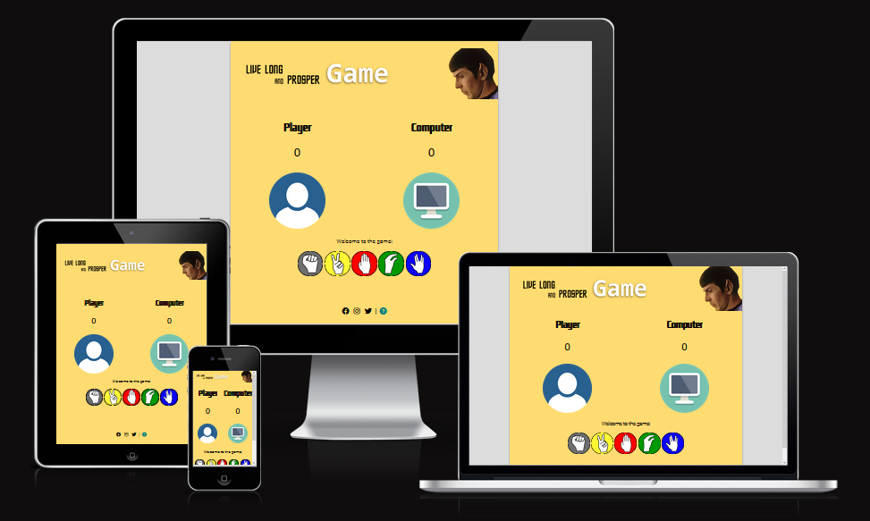
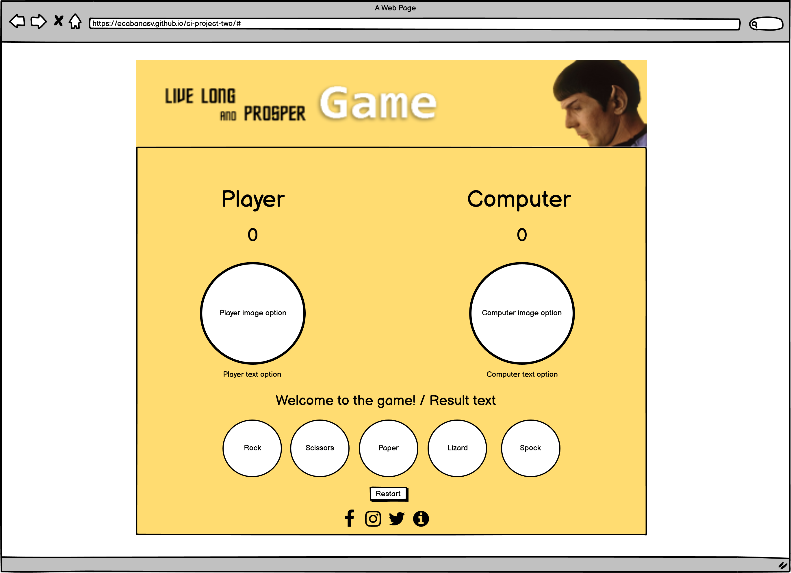

# Website
Welcome to "Live and prosper game"!

## Introduction

Live long and prosper game is an expansion of the rock paper scissors game. Two additional choices: lizard & spock are added to the traditional game.

The combinations of the choices are as follow:

- Scissors cuts Paper
- Paper covers Rock
- Rock crushes Lizard
- Lizard poisons Spock
- Spock smashes Scissors
- Scissors decapitate Lizard
- Lizard eats Paper
- Paper disproves Spock
- Spock vaporizes Rock
- Rock crushes Scissors

The live website can be found on this [link](https://ecabanasv.github.io/ci-project-two/#).

## Table of Contents

# Table of Contents
 [1. UX Design](#ux)
  - [User Goals:](#user-goals)
  - [User Expectations:](#user-expectations)
  - [Colour scheme and font](#color-scheme)
  - [Website skeleton](#wireframes)
  - [Index](#index-page)
      
  [2. Features](#features)

  [3.Technologies](#technologies)

  [4.Testing](#testing-phase)

  [5.Bugs](#bugs)

  [6. Deployment](#deployment)

  [7. Acknowledgement](#acknowledgement)

  
# 1. UX design
  [Go to the top](#table-of-contents)

## 1.1 User Goals
  [Go to the top](#table-of-contents)
  
The project's main objective is to offer the visiting user the possibility of playing the game "Live long and prosper", which is a modification of the traditional game "Rock, paper and scissors".

With a simple interface, the user can start the game at any time, and his opponent will be the computer that randomly picks his choice.

The terminal game is when one of the two (player or computer) reaches 10 points. Both at the end of each game and after the second point, the player will have the option to restart the game.

## 1.2 User Expectations
  [Go to the top](#table-of-contents)
  
* Simple web structure and easy access. In a few clicks, user can access all options of the game.
* The user interface is intuitive and any type of user can use it without any advanced knowledge.
* Responsive web content for all types of devices (laptop, tablet and phone).
* Compatibility with the most used web browsers (Chrome, Firefox and Edge).

## 1.3 Color Scheme
  [Go to the top](#table-of-contents)
  
* HTML: #gray
* container: #ffdc71

## 1.4 Website Skeleton
  [Go to the top](#table-of-contents)
  
  [Balsamiq](https://balsamiq.com/) is the software that has been used to develop the wireframes of the web. It was handy to start the idea of the project, and with it, I could quickly generate the code of the web structure. Captures developed with the Balsamiq program are attached below.
  

### Index Page

  
# 2. Features
  [Go to the top](#table-of-contents)

   
# 3. Technologies Used
  [Go to the top](#table-of-contents)

* [HTML5](https://en.wikipedia.org/wiki/HTML5) for structure and content of the website.
* [CSS3](https://en.wikipedia.org/wiki/CSS) is used for styling the content and structuring using the CSS Grid system.
* [Balsamiq](https://balsamiq.com/) used for creating wireframes in Desktop and Mobile versions.
* [Google Fonts](https://fonts.google.com/) used to import font-family "Open Sans".
* [Adobe Photoshop](https://www.adobe.com/uk/products/photoshop.html) used for image edition (header, resizing and optimizing size)
* [Font Awesome](https://fontawesome.com/) used for the icons on the menu, articles and contact page.
* [Chrome](https://www.google.com/intl/en_uk/chrome/) used for debugging and test the website.
* [Firefox Developer Edition](https://www.mozilla.org/es-ES/firefox/developer/) used for debugging and testing the website.
* [Github](https://github.com/) is used to create and update the online repository of the project.
* [Gitpod](https://www.gitpod.io/) used for coding the project online.
* [W3C Markup](https://validator.w3.org/) tool used for validate the HTML code of the project.
* [Jigsaw validation](https://jigsaw.w3.org/) tool used for validating the CSS code of the project.
* [JS Hint](https://jshint.com/) tool used for validating the JS code of the project.

* [Ami](http://ami.responsivedesign.is/#) used for generate the different responsive versions of the project.

  
# 4. Testing
  [Go to the top](#table-of-contents)
 
## 4.1 Testing using tools

### 4.1.1 Browser Developer tools

The built-in tools of the Google Chrome and Firefox Developer Edition browsers have been used in the project. In this case, inspect each HTML and CSS element. These tools were also used to run different performance and optimization tests, such as Google Chrome's Lighthouse or the tools included to view the web on different device sizes.

### 4.1.2 Responsive Tools

An initial image has been included in the README made through the Ami web tool that includes the version in different web formats (Laptop, Tablet and Phone)

### 4.1.3 W3C Validator Tools (HTML and CSS)

For the validation of the HTML code, the official tool has been used [W3C Markup](https://validator.w3.org/#validate_by_input+with_options).

### 4.1.4 JS Hint (JavaScript)

For the validation of the JavaScript code, the JSHint tool has been used [JSHint](https://jshint.com/).

## 4.2 Manual Testing

Web display has been tested on all available devices from the "Responsive Design Mode" tool of Firefox Developer Edition. This device list includes the following:

- Galaxy Note 20 (412x915)
- Galaxy S20 (360x800)
- Ipad (810x1080)
- Iphone 11 Pro (375x812)
- IPhone 12/13 Mini (390x844)
- IPhone 11 SE 2nd Gen (375x667)
- Kindle Fire HDX (800x1280)

 ## index.html - design:
TEST            | RESULT                           | OK / FAIL  
--------------- | -------------------------------- | ---------------
Header| Correct visualization of header image | OK
Footer| Correct size and links / social & info | OK
Head title| Correct title | OK
Favicon| Correct visualization of favicon | OK
Responsive design| Correct visualization of content | OK

 ## index.html - game functionality:
TEST            | RESULT                           | OK / FAIL  
--------------- | -------------------------------- | ---------------
player/computer title color| Changing color when player or computer is winning/losing | OK
player/computer scores| Increases player/computer scores when win round | OK
text result| Show round winner / Game winner / Welcome text / Restart text | OK
player/computer images| Show image of choice for Player/Computer when select panel choice  | OK
panel choices| Correct functionality of game when player choose option: Rock, Scissors, Paper, Lizard and Spock | OK
winner round| Show winner round text when player/computer reach 10 poins | OK
restart button| Show restart button after player/computer reach 2 points | OK

 ### Footer

TEST            | RESULT                           | OK / FAIL  
--------------- | -------------------------------- | ---------------
Facebook | Open FB site in new tab | OK
Instagram| Open IG site in new tab  | OK
Twitter| Open Twitter site in new tab | OK
Instructions | Load sweet alert with instructions info | OK

  
# 5. Bugs
  [Go to the top](#table-of-contents)

### Solved bugs

  
# 6. Deployment
  [Go to the top](#table-of-contents)
 
The main branch of this repository has been used for the deployed version of this application.

## Via Gitpod

The project deployment was based on the [Code Institute Gitpod Full Template](https://github.com/Code-Institute-Org/gitpod-full-template).

  - Click the `Use This Template` button.
  - Add a repository name and brief description.
  - Click the `Create Repository from Template` to create your repository.
  - To create a Gitpod workspace you then need to click `Gitpod`, this can take a few minutes.
  - When you want to work on the project it is best to open the workspace from Gitpod (rather than Github) as this will open your previous workspace rather than create a new one. You should pin the workspace so that it isn't deleted.
  -  Committing your work should be done often and should have clear/explanatory messages, use the following commands to make your commits:
    - `git add .`: adds all modified files to a staging area
    - `git commit -m "A message explaining your commit"`: commits all changes to a local repository.
    - `git push`: pushes all your committed changes to your Github repository.
  - You can view the website in a browser by using the command `python3 -m http.server` and clicking on the button `Open Browser` on the box that will pop up.

*Forking the GitHub Repository*

If you want to make changes to your repository without affecting it, you can make a copy of it by 'Forking' it. This ensures your original repository remains unchanged.

  1. Find the relevant GitHub repository
  2. In the top right corner of the page, click the Fork button (under your account)
  3. Your repository has now been 'Forked' and you have a copy to work on

*Cloning the GitHub Repository*

Cloning your repository will allow you to download a local version of the repository to be worked on. Cloning can also be a great way to backup your work.

  1. Find the relevant GitHub repository
  2. Press the arrow on the Code button
  3. Copy the link that is shown in the drop-down
  4. Now open Gitpod & select the directory location where you would like the clone created
  5. In the terminal type 'git clone' & then paste the link you copied on GitHub
  6. Press enter and your local clone will be created.

## Via Github Pages

  - The live website was deployed to GitHub pages. The steps to deploy are as follows: 
  
    1. Log in to GitHub
    2. In your Repository section, select the project repository that you want to deploy
    3. In the menu located at the top of this section, click `Settings`
    4. Select `Pages` on the left-hand menu - this is around halfway down
    5. In the source section, select branch `Master` and save
    6. The page is then given a site URL which you will see above the source section.

Please note it can take a while for this link to become fully active. 

The live link can be found [here](https://ecabanasv.github.io/ci-project-two/#).

  
# 7. Acknowledgement
  [Go to the top](#table-of-contents)
 
### Code

### Content

